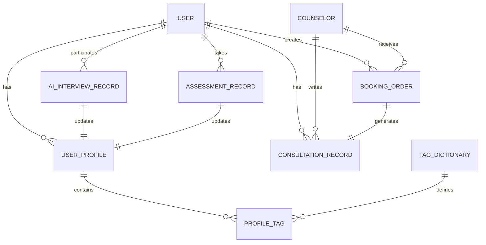

# 可鹿 APP 数据中台架构设计

## 1. ER图 (实体关系图)



## 2. 数据流图

1. **终端数据采集**: 用户填写量表 (PHQ-9/GAD-7) -> AI 访谈倾诉 -> 语音咨询。
2. **数据处理引擎 (AI Agent & 规则引擎)**:
   - NLP分析语音/文本情感。
   - 提取业务实体并匹配标签体系 (Tag Dictionary)。
   - 风险控制引擎 (Risk System) 实时监听敏感词和高危情绪分值。
3. **中台核心 (画像引擎)**:
   - 聚合状态数据生成最终 `UserProfile`。
4. **业务输出**:
   - 推荐系统通过 Profile 匹配干预内容和匹配咨询师。

## 3. 用户画像结构 (Profile Schema)

```json
{
  "userId": "u_1001",
  "basicInfo": {
    "age": 24,
    "gender": "female",
    "occupation": "student"
  },
  "psychStats": {
    "currentScore": 68,
    "trend": -5,
    "stressLevel": "high"
  },
  "tags": [
    {"categoryId": "t_01", "name": "考试焦虑", "weight": 0.8},
    {"categoryId": "t_02", "name": "讨好型人格", "weight": 0.6}
  ],
  "riskProfile": {
    "level": "medium",
    "lastTriggers": ["失眠", "哭泣"],
    "requiresIntervention": true
  }
}
```

## 4. 标签体系 (Tag Dictionary)

采用三级标签架构：
- **一级维度**: 情绪状态 / 性格特质 / 人际关系 / 发展阶段
- **二级维度**: 焦虑类 / 抑郁类 / 职场 / 家庭 / 亲密关系
- **三级标签**: 考试焦虑、讨好型、述情障碍、自我PUA、超我过强

## 5. 推荐逻辑 (Recommendation System)

基于标签相似度和协同过滤：
1. **内容推荐 (今日建议)**: 提取用户画像中 `weight` 最高的前三项标签，匹配干预内容库（如：对应“失眠”标签 -> 推荐“4-7-8呼吸法音频”）。
2. **咨询师推荐**: 提取用户核心困扰标签，匹配咨询师 `specialties`（擅长领域）和历史成功解决该类标签用户的服务评分。

## 6. 风险识别逻辑 (Risk Engine)

1. **静态规则**: PHQ-9 量表第9题（自杀倾向）得分 > 0，直接触发 `HIGH_RISK`。
2. **动态NLP监控**: AI访谈和咨询记录中提取出特定实体（如“不想活了”、“结束一切”、自伤痕迹），触发警报。
3. **行为异动**: 连续3天主观心理评分低于30分，或深夜高频使用AI访谈功能。

处理机制：限制内容（不发致郁内容） -> APP 极强干预提醒（弹窗推送危机干预热线） -> 心理咨询师后台标红。

## 7. 接口设计

- `POST /api/v1/assessments/submit`: 提交量表数据（返回风险评估初判）。
- `POST /api/v1/ai-interview/analyze`: AI 访谈切片分析（生成标签流）。
- `GET /api/v1/profile/me`: 获取最新整合后的用户画像。
- `POST /api/v1/recommendations/content`: 基于当前画像拉取定制化干预内容。

## 8. 数据库设计 (Core Collections)

- `users`: 基础账户信息。
- `user_profiles`: 动态更新的画像大宽表。
- `tag_dictionary`: 标签元数据维护。
- `counselors`: 咨询师主数据。
- `assessments`: 量表字典及用户答卷流水。
- `consultation_records`: 包含加密脱敏处理后的客观咨询纪要。
