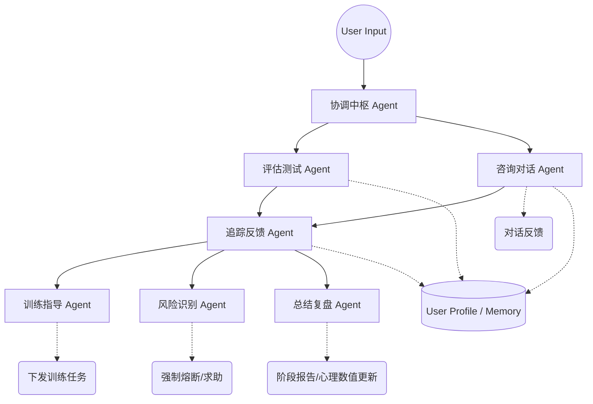

# 可鹿 (XiangWang) - 全局系统与智能体架构设计与路线图

## 01 产品定位

**名称:** 可鹿 (XiangWang)
**定位:** 多智能体协同 (Multi-Agent Orchestrated) 心理健康支持平台。
**核心理念:** 不是工具，不是社区，而是一个“心理驾驶舱”。平台的核心壁垒在于后端的**多智能体编排系统 (Agent Orchestration)**，前端（首页、AI页）仅仅是后端智能体决策和计算结果的**呈现层**。

## 02 用户画像

**目标群体:** 18-24岁 大学生、初入职场青年。
**核心困境:** 考研焦虑、无意义感、失眠、社交回避、求职压力。
**行为特征:** 极强隐私性、需要即时确认感、抗拒重度“医疗诊断”感、需要循序渐进的引导而非生硬干预。
**画像架构:** 依据动态标签体系构建用户心理模型 (`UserProfile`)，包括：情绪基础线、高频敏感词、干预接受度。

## 03 Agent 体系 (核心护城河) ⭐

产品的一切功能建立在以下六个核心 Agent 的编排与通讯机制之上：

1. **协调中枢 Agent**: 流量分发与上下文管理。决定该触发哪个特定领域的 Agent，并传递全局上下文 (User Context)。
2. **评估测试 Agent**: (输入: 量表答题/隐式对话行为 | 输出: 初始量表定级、情绪波动锚点)。负责形成心理基础线。
3. **咨询对话 Agent**: (输入: 语言输入 | 输出: 共情倾听、CBT引导话术、L1级陪伴)。用户感知最强的前台 Agent。
4. **追踪反馈 Agent**: (输入: 对话提炼、任务追踪 | 输出: 情绪波动分 `DynamicScore`)。实时监听用户的状态变化。
5. **训练指导 Agent**: (输入: 情绪画像、目标设定 | 输出: 个性化行为干预任务、正念指导)。将咨询转化为具体行动。
6. **风险识别 Agent**: (输入: 文本/情绪监控流 | 输出: 风险等级判定 `RiskLevel`)。**最高优先级**，基于红线系统执行“熔断”，跳过AI，进入L4干预。
7. **总结复盘 Agent**: (输入: 历史对话、任务完成率 | 输出: 周期成长报告)。

## 04 数据体系 ⭐

**流动方向:** `前端交互 -> Queue -> Agent 处理 -> Memory/Profile 更新 -> 前端状态重算`

1. **量表数据**: PHQ-9, GAD-7 结构化数据录入。
2. **对话数据**: 矢量化存储 (Vector DB) 做情感分类和实体抽取。
3. **画像结构 (User Profile)**:
   - `base_score`: 基础心理能量值。
   - `dynamic_variance`: 短期波动率。
   - `tags`: [] 权重衰减标签（如 "失眠": 0.8, 每3天递减0.1）
4. **日志与埋点**: 所有Agent的调度调用、响应延迟均需落表监控。

## 05 首页 (Agent 结果展示层) ⭐

首页不生产内容，首页只是 追踪 Agent、训练 Agent、风险 Agent 计算结果的 Dashboard。

- **用户状态卡**: 由 **追踪反馈 Agent** 提供 `Score` 与 `Tags`。
- **今日建议卡**: 由 **训练指导 Agent** 每日下发微行动。
- **AI入口卡**: 进入 **咨询对话 Agent** 的传送门。
- **成长计划卡**: 由 **总结复盘 Agent** 提供打卡进度与反馈。
- **风险提醒卡**: 仅当 **风险识别 Agent** 将 `RiskLevel` 置为 HIGH 时出现。

## 06 AI页 (Agent 工作台) ⭐

AI页不再简单的呈现单条对话信息流，而是结构化的四层模块：

1. **对话分析区**: **咨询 Agent** 专属聊天区，带隐式的多Agent运行状态指示器，建立用户信任。
2. **技能特训池**: **训练 Agent** 的交互入口。
3. **量表评估中心**: **评估 Agent** 的入口。
4. **阶段复盘报告**: **总结 Agent** 生成内容展示。

## 07 我的 (个人数字档案)

聚焦“自我探索与觉察”的个人中心，包含：
- 动态心理画像 (从基础画像到近期焦点)
- 成长与干预记录，包括所有完成的CBT和正念任务统计
- 我的订单，咨询卡券管理

## 08 预约 (L2 / L3 人工分流)

基于评估结果进行智能匹配，提升用户预约转化与疗效：
- 展示咨询师的核心流派与匹配度 (例如 "咨询师A 与你的失眠标签匹配度: 95%")
- 降低试错成本。

## 09 支付 (业务闭环)

接入平台化多级支付能力（包括但不限于单次咨询、储值包、特定课程结构），要求极简的安全交互。

## 10 履约 (音视频咨询)

三阶段闭环架构：
- **咨询前**: 系统自动脱敏并生成近期画像，提交给咨询师。
- **咨询中**: 稳定可靠的RTC组件。
- **咨询后**: 咨询师提交专业反馈，由 **总结 Agent** 进行融合转换，变为前端界面的通俗化任务（反哺首页）。

## 11 后台系统

- **人工干预工作台**: L4预警直达急救热线。
- **Agent监控台**: 监测各智能体的准确率、调度延迟。
- **内容配置后台**: 管理默认CBT任务，干预库等。

## 12 MVP路线图
- **Phase 1**: Agent 体系核心逻辑梳理与“咨询 Agent”、“风险 Agent”最小化原型部署，搭载简化首页与 AI 聊天界面。
- **Phase 2**: 引入“训练 Agent”、“追踪 Agent”，完成“今日建议”与“心理数值”的全链路打通。
- **Phase 3**: 完善人工咨询预约预约、支付以及闭环履约流程。
- **Phase 4**: 引入多模态识别与深度复盘闭环。
